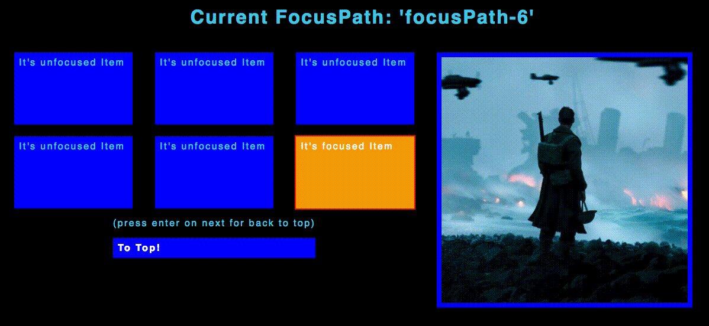

# React-TV Navigation

> Navigation for TVs using React-TV

[](https://circleci.com/gh/react-tv/react-tv-navigation/tree/master)

tl;dr: [Based on Netflix TV Navigation System](https://medium.com/netflix-techblog/pass-the-remote-user-input-on-tv-devices-923f6920c9a8)



[See code from this example](https://github.com/react-tv/react-tv/blob/master/examples/navigation/src/App.js)

React-TV-Navigation is a separated package from renderer to manage focusable components.

## Installing

```bash
yarn add react-tv-navigation
```

React and [React-TV](http://github.com/react-tv/react-tv) are peer-dependencies.

## `withFocusable` and `withNavigation`

React-TV Navigation exports two functions: `withFocusable` and `withNavigation`.

Navigation based on HOC and HOF beeing declarative.

```jsx
import React from 'react'
import ReactTV, { renderOnAppLoaded } from 'react-tv'
import { withFocusable, withNavigation } from 'react-tv-navigation'

const Item = ({focused, setFocus, focusPath}) => {
  focused = (focused) ? 'focused' : 'unfocused'
  return (
    <div onClick={() => { setFocus() }} >
      It's {focused} Item
    </div>
  )
}

const Button = ({focused, setFocus, focusPath}) => {
  return (
    <div onClick={() => { setFocus('focusPath-1') }}>
      Back To First Item!
    </div>
  )
}

const FocusableItem = withFocusable({focusPath: 'item-1'})(Item)
const FocusableOtherItem = withFocusable({focusPath: 'item-2'})(Item)
const FocusableButton = withFocusable({focusPath: 'button'})(Button)

function App({currentFocusPath}) {
  return (
    <div>
      <h1>Current FocusPath: '{currentFocusPath}'</h1>,
      <FocusableItem/>
      <FocusableOtherItem/>
      <FocusableButton/>
    </div>
  )
}
```

Soon we'll write a decent README.md :)

#### License by MIT
